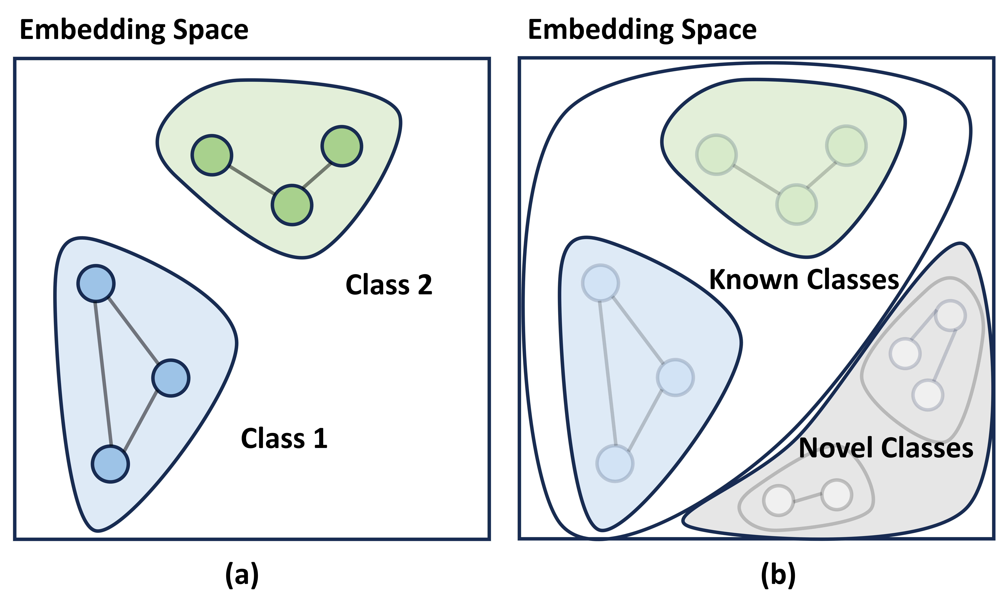

# EviNet

The official implementation for paper ***"EviNet: Evidential Reasoning Network for Resilient Graph Learning in the Open and Noisy Environments"***

## Overview

This repository contains the code for **Evidential Reasoning Network(EviNet)**, a framework designed to address graph learning challenges in open and noisy environments. Traditional graph models struggle handling both misclassified samples and out-of-distribution (OOD) samples. EviNet leverages **Beta embeddings** and **subjective logic** to estimate uncertainty and effectively detect both types of anomalies.

### Core Modules


1. **Dissonance Reasoning (M1)**: Detects misclassifications by computing a **dissonance score** that measures conflicting evidence, indicating samples that belong to multiple known classes.
2. **Vacuity Reasoning (M2)**: Identifies OOD data by detecting a **lack of evidence** for known classes, using logical negation to create implicit support regions for novel classes.



EviNet achieves robust performance by balancing **in-distribution classification, misclassification detection, and OOD detection**. The framework provides support regions for known and novel classes via logical reasoning, helping users handle uncertainties in real-world scenarios.


## Installation

1. Clone this repository.

2. Install the dependencies to conda via `env.yaml`.


## Run the demo

For reproducing the baselines' results in Table 1

```bash
cd baseline
bash run_base.sh
```

For reproducing EviNet results in  Table 1

```bash
bash run.sh
```

For reproducing Table 2

```bash
bash run_ablation.sh
```


The results can be found in xxx

### 


## Reference